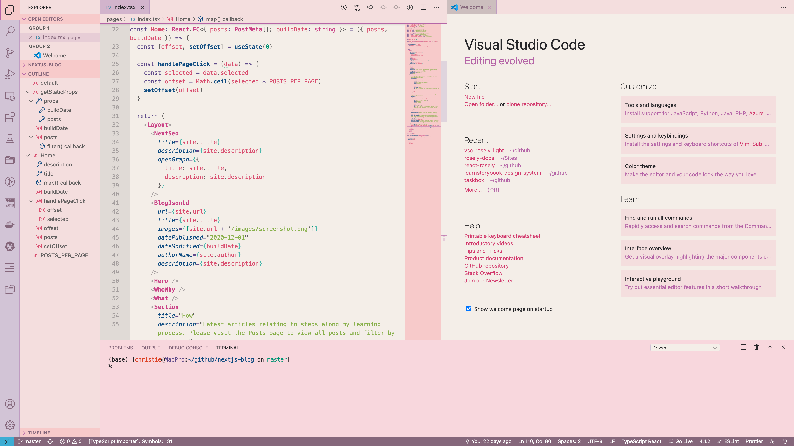

The Rosely Visual Studio Code Theme is based on the Rosely palette.

It is a deliberately low contrast theme full of soothing contemporary colours designed to induce calmness and serenity and works well even on lower contrast displays. It is not eye fatiguing as it avoids high contrast colour changes and helps the eyes to focus on what is important.

The extension can be installed directly from within Visual Studio Code or downloaded from the [Visual Studio Marketplace](https://marketplace.visualstudio.com/items?itemName=HelloTham.vsc-rosely-light).

The source code is available on [Github](https://github.com/hellotham/vsc-rosely-light).

